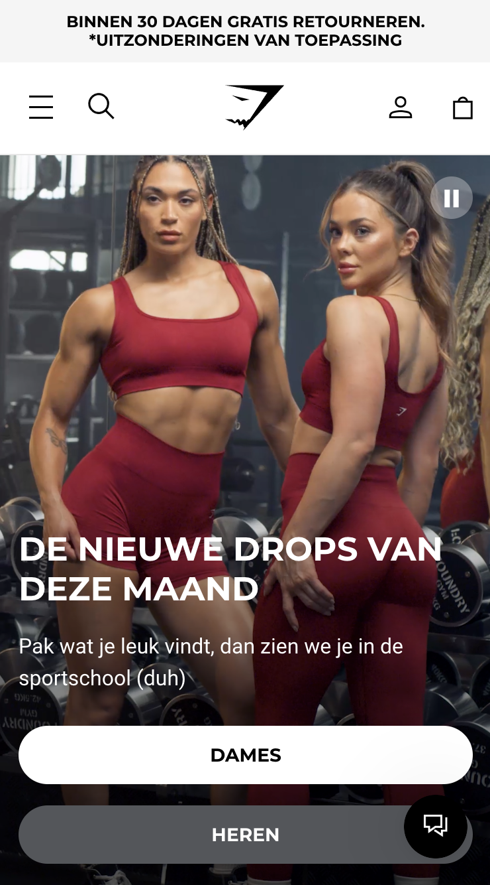

# Procesverslag
Markdown is een simpele manier om HTML te schrijven.  
Markdown cheat cheet: [Hulp bij het schrijven van Markdown](https://github.com/adam-p/markdown-here/wiki/Markdown-Cheatsheet).

Nb. De standaardstructuur en de spartaanse opmaak van de README.md zijn helemaal prima. Het gaat om de inhoud van je procesverslag. Besteedt de tijd voor pracht en praal aan je website.

Nb. Door *open* toe te voegen aan een *details* element kun je deze standaard open zetten. Fijn om dat steeds voor de relevante stuk(ken) te doen.

## Jij

  
uitwerken voor kick-off werkgroep

  ### Auteur:
  (Mehmet Demirsoy)

  #### Je startniveau:
  (blauwe piste)

  #### Je focus:
  (Responsive)
 

## Je website

  
uitwerken voor kick-off werkgroep

  ### Je opdracht:
  [https://nl.gymshark.com]

  #### Screenshot(s) van de eerste pagina (small screen): 
  Gymshark  
  

  #### Screenshot(s) van de tweede pagina (small screen):
  Gymshark heren  
  
 

## Toegankelijkheidstest 1/2 (week 1)

  
uitwerken na test in 2e werkgroep

  ### Bevindingen
 	  De website heeft ongestructureerde HTML-code. Bij een deel is eerst de afbeelding (img) erin gecodeerd en daarna pas de alt-tekst, wat voor onduidelijkheid zorgt. Daarnaast zijn niet alle alt-teksten goed uitgelegd.
    De taal klopt niet helemaal. Het is een Nederlandse site, maar je ziet vaak Engelse woorden zoals “shop nu” en “shop now” door elkaar. Dat maakt het soms verwarrend.
	  Het valt me op dat Gymshark niet volledig focust op navigatiegemak voor mensen met een beperking. De code is niet goed geformuleerd voor schermlezers en hulpmiddelen.
	  Het kleurcontrast is op sommige plekken te laag, waardoor het lastig kan zijn om te lezen. Ze hebben ook geen dark mode, wat best essentieel is voor mensen met sensorische problemen.

## Breakdownschets (week 1)

  
uitwerken na afloop 3e werkgroep

  ### de hele pagina: 
  

## Voortgang 1 (week 2)

  
uitwerken voor 1e voortgang

  ### Stand van zaken
  hier dit ging goed & dit was lastig (neem ook screenshots op van delen van je website en code)

  ### Agenda voor meeting
  samen met je groepje opstellen

 	1. Waarom is het belangrijk om semantische tags zoals <header>, <nav>, en <footer> te gebruiken in plaats van alleen 
?
  2. Hoe zorgen semantische tags ervoor dat een website toegankelijker wordt?
  3. Waarom is het beter om voor elke pagina een aparte CSS-file te maken in plaats van één grote file?
  4. Hoe kunnen we kleuren en fonts centraal beheren, zodat we ze eenvoudig kunnen aanpassen?

  ### Verslag van meeting
  hier na afloop snel de uitkomsten van de meeting vastleggen

	1. Structuur en Semantiek
	   Gebruik van header, nav, en footer zorgt voor een semantisch correcte structuur en overzichtelijkheid.
	2  CSS Organisatie
	   Een gescheiden stylesheet per pagina maakt onderhoud en aanpassingen eenvoudiger.
	   Het definiëren van kleuren en lettertypes in :root zorgt voor consistentie en snelle aanpassing.
	3  Code Documentatie 
     Regelmatige notities in de code zijn essentieel voor leesbaarheid en terugvinden van functionaliteiten.
	4. Positionering en Laagbeheer
	   Position creëert lagen, waardoor elementen zoals iconen over elkaar geplaatst kunnen worden voor een gelaagd ontwerp.

## Voortgang 2 (week 3)

  
uitwerken voor 2e voortgang

  ### Stand van zaken
  hier dit ging goed & dit was lastig (neem ook screenshots op van delen van je website en code)

  ### Agenda voor meeting
  samen met je groepje opstellen

  1.	Hoe zorg ik ervoor dat afbeeldingen netjes binnen hun container passen zonder hun verhoudingen te verliezen?
	2.	Wat is het verschil tussen object-fit: cover en object-fit: contain, en wanneer gebruik ik welke?
	3.	Hoe gebruik ik overflow: hidden om een strak ontwerp te behouden en uitstekende delen af te snijden?
	4.	Hoe kan ik tekst eenvoudig in hoofdletters weergeven zonder mijn HTML aan te passen?
	5.	Waarom is een semantisch correcte HTML-structuur belangrijk voor toegankelijkheid, en hoe helpt dit screenreaders?
	6.	Hoe werkt de selector ul li + li, en hoe gebruik ik die voor gerichte stijlen?
	7.	Waarom is het gebruik van px soms nodig, bijvoorbeeld voor horizontale lijnen (
), ondanks dat flexibele eenheden vaak beter zijn?

  ### Verslag van meeting
  hier na afloop snel de uitkomsten van de meeting vastleggen

	1. Object Positionering en Verbergen van Uitsteken
	   object-fit: cover zorgt voor een nette plaatsing van afbeeldingen in hun containers.
	   overflow: hidden snijdt uitstekende delen van afbeeldingen en elementen af om een strak design te behouden.
	2  Styling en Transformeren
	   text-transform: uppercase maakt het mogelijk om tekst eenvoudig in hoofdletters weer te geven zonder de HTML te veranderen.
	3. Semantiek en Toegankelijkheid
	   Een semantisch correcte opbouw van de HTML verbetert de toegankelijkheid, vooral voor screenreaders, door bijvoorbeeld de h2 bovenaan te houden.
	4. Navigeren in CSS Selectors
	   De selector ul li + li selecteert het broertje-element, wat handig is om elementen op elkaar te laten aansluiten zonder de eerste te stylen.
	5. Opmerkingen over HTML
	   Het gebruik van px is beperkt, maar toegestaan voor lijnen wanneer ze functioneel een horizontale lijn (hr) moeten voorstellen.

## Toegankelijkheidstest 2/2 (week 4)

  
uitwerken na test in 9e werkgroep

  ### Bevindingen
  Lijst met je bevindingen die in de test naar voren kwamen (geef ook aan wat er verbeterd is):

## Voortgang 3 (week 4)

  
uitwerken voor 3e voortgang

  ### Stand van zaken
  hier dit ging goed & dit was lastig (neem ook screenshots op van delen van je website en code)

  ### Agenda voor meeting
  samen met je groepje opstellen
	1.	 Waarom is het belangrijk om de <h2> bovenaan mijn code te plaatsen?
	2.	 Hoe helpt een logische semantische structuur bij toegankelijkheid voor screenreaders?
	3.	 Hoe gebruik ik z-index om ervoor te zorgen dat tekst niet verborgen raakt achter afbeeldingen?
	4.	 Wat is het verschil tussen z-index: 0 en een hogere waarde, en wanneer gebruik ik deze?
	5.	 Wat betekent het dat <a>-elementen inline zijn, en hoe beïnvloedt dat de opmaak?
	6.	 Hoe kan ik inline elementen zoals <a> combineren met blokelementen voor een consistente structuur

  ### Verslag van meeting
  hier na afloop snel de uitkomsten van de meeting vastleggen

 	1. Eerste Pagina en GitHub
	   De eerste pagina is afgerond en alle bestanden zijn opgeslagen op GitHub voor versiebeheer.
	2. Structuur van de Code
	   Door de h2 altijd bovenaan de code te plaatsen, wordt de semantische structuur verbeterd, waardoor screenreaders de belangrijkste informatie eerst lezen.
	3. Z-Index en Positionering
	   De z-index bepaalt welke elementen boven elkaar komen. Het plaatsen van z-index boven de nul zorgt ervoor dat tekst (zoals h3) altijd zichtbaar voor het plaatje blijft.
	4. Inline Elementen
		 a-elementen zijn inline, wat betekent dat ze in lijn staan met de tekst. Dit is handig om te begrijpen bij het structureren van links en teksten.

## Eindgesprek (week 5)

  
uitwerken voor eindgesprek

  ### Je uitkomst - karakteristiek screenshots:
  
  
Het lijkt bijna sprekend op de originele website, met hier en daar wat aanpassingen. Maar ik ben er echt heel blij mee! Ik liet het eerst aan mijn vrienden zien, en zij hadden niet eens door dat het niet de originele website was, hihi.

  

  ### Dit ging goed/Heb ik geleerd: 
  Ik heb geleerd hoe je semantisch correct moet coderen, en de basis is me nu gelukt! In het begin vond ik het best pittig en was ik soms echt van slag. Vooral omdat ik niet zo goed ben in coderen. Maar ik ben blij met hoever ik ben gekomen en dat ik nu begrijp wat de code doet en waar het naartoe leidt.

  Alhoewel ik tegen een paar obstakels ben aangelopen, heb ik ook veel kunnen oplossen dankzij de hulp van verschillende studentenassistenten, maar ook Baha, Ali en natuurlijk Sanne! Het is echt fijn om te merken dat wanneer ik mijn probleem uitleg en stap voor stap vertel wat ik aan het doen ben, ik meer zekerheid krijg over wat ik leer. Dat gaf me het gevoel dat ik echt kennis aan het opbouwen ben.

  Er zijn zoveel dingen die ik heb geleerd, zoals beter positioneren, selectoren zoals section:nth-of-type() gebruiken, begrijpen wat z-index doet, en hoe je links of tekst over een afbeelding kunt plaatsen alsof je verschillende lagen creëert. Ik heb ook variabelen gemaakt, zodat ik bijvoorbeeld een kleur die ik vaak gebruik, makkelijk kan toepassen met een eigen titel. Daarnaast heb ik inzicht gekregen waarom het belangrijk is om een logische volgorde aan te houden, zoals eerst een <h2>, dan een 
 en daarna een , zodat de site toegankelijker wordt voor mensen met een beperking.

  Maar eerlijk gezegd geloof ik dat AI dit in de toekomst minder belangrijk zal maken, omdat AI-systemen dat soort problemen zelf kunnen oplossen. Maar goed, dat is een discussie die ik nu niet ga voeren, haha! ^^
 
  

  ### Dit was lastig/Is niet gelukt:
  ik heb geen screenshots van waar ik vast liep maar wel een foto van mezelf waar ik huil omdat het mij niet lukte om de expandable menu omlaag te krijgen <3
  (geloof me er zijn meerdere huil momenten geweest die ik niet heb vastgelegd helaas)

  

## Bronnenlijst

  
continu bijhouden terwijl je werkt

  Nb. Wees specifiek ('css-tricks' als bron is bijv. niet specifiek genoeg). 
  Nb. ChatGpT en andere AI horen er ook bij.
  Nb. Vermeld de bronnen ook in je code.

  1. Chatgpt (alhoewel het niet altijd goed helpt)
  2. Baha
  3. Ali
  4. https://www.w3schools.com
  5. https://css-tricks.com

